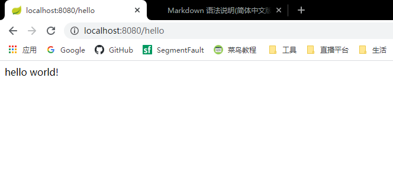

# SpringBoot学习笔记


## 一、SpringBoot HelloWorld程序
1、创建一个maven工程
    
2、导入Spring Boot相关依赖
```xml
    <parent>
        <groupId>org.springframework.boot</groupId>
        <artifactId>spring-boot-starter-parent</artifactId>
        <version>2.3.1.BUILD-SNAPSHOT</version>
    </parent>
    <dependencies>
        <dependency>
            <groupId>org.springframework.boot</groupId>
            <artifactId>spring-boot-starter-web</artifactId>
        </dependency>
    </dependencies>
```
3、编写SpringBoot主程序
```java
    
    @SpringBootApplication
    public class MySpringBootDemoMainApplication {
    	public static void main(String[] args) {
    		SpringApplication.run(MySpringBootDemoMainApplication.class, args);
    	} 
    }
```
@SpringBootApplication:用来标识这是一个主程序类，说明这是一个SpringBoot应用

4、编写相应的业务逻辑
```java
   @Controller
   public class HelloController { 
  
   	@RequestMapping("/hello")
   	@ResponseBody
   	public String helloWorld(){
   		return "hello world!";
   	}
   } 
```
5、测试访问 

1)、启动主程序，并在浏览器中输入“localhost:8080/hello”，看到如下效果


## 二、配置文件

1、springBoot配置文件：application.properties,application.yml。名称是固定的

2、配置文件的作用：修改SpringBoot中默认配置的值

3、.yml文件：YAML（YAML Ain't Markup Language），一种标记语言，比xml、json更适合做配置文件

## 三、YML语法格式

#### 1、基础语法：
1）、key:(空格)value 表示一对键值对
```yaml
    port: 8080
```
2）、使用空格和换行表示层级关系：
```yaml
    server:
      port: 8080
```
3)、属性和值大小写敏感
    
